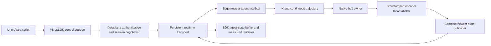

# Control responsiveness review and implementation plan

Date: 2026-09-11, Los Angeles. Measurements recorded around 04:01–04:03 UTC on September 12. This is an engineering audit and source checkpoint, not a declaration that the robot meets its performance requirements.

## Decision

The current system does not meet 30 Hz fresh observed pose delivery, 30 Hz continuous command delivery, or 30 Hz per-servo TTL feedback. A fast renderer cannot compensate for those failures. The next implementation should establish one instrumented streaming control path through VitrusSDK and the authenticated Vitrus dataplane, with independently scheduled native interpolation and measurement. Increasing a rate constant or weakening a freshness check is not the solution.

No physical motion or runtime configuration was changed during this audit. The latest user session was already stopped. The tests below include new read-only stream observers and analysis of that actual manual session; they are not a new motion qualification.

## Measured evidence

| Stage | Evidence | Interpretation |
|---|---|---|
| Latest manual TCP command receipts | 14 accepted receipts; median app-ingress-to-receipt 367 ms, maximum 1809 ms | This is acknowledgement latency, not measured onset of physical motion. It is still incompatible with a 33.3 ms interactive budget when the sender waits for each acknowledgement. |
| Public command round trip | Median 347 ms, maximum 1798 ms | The correlated request path is a primary control bottleneck. A serialized sender with a 347 ms service time has only about 2.9 updates/s of sustained capacity, regardless of a 30/60 Hz browser producer. |
| Manual target handling | 137 browser target events, 17 forward starts, 119 coalescing events, 14 accepted receipts, 3 Edge rejects | Counts cover a trace with pauses, not a continuous throughput benchmark. Coalescing prevents replay but does not deliver a responsive path. Source-age rejects were 580, 699 and 948 ms. |
| Device-local SSE, requested 25 Hz | 349 distinct sequences / 15.005 s = 23.3 Hz; gap p95 51 ms, maximum 72 ms | Configured 25 Hz cannot meet a 30 Hz floor. |
| Device-local SSE, requested 60 Hz | 715 distinct sequences / 15.019 s = 47.6 Hz; gap p95 31 ms, maximum 65 ms | The producer has headroom above 30 Hz in this stopped, bounded test. This is not per-axis encoder rate or active-motion qualification. |
| Mac forwarded SSE, requested 25 Hz | 344 frames / 15 s = 22.9 Hz; gap p95 147 ms, maximum 667 ms | Delivery jitter is substantially worse than the device-local observer. These paired windows are observational, not a controlled attribution to one network component. |
| App WebSocket observer | 380 frames / 15 s = 25.3 Hz; gap p95 122 ms, maximum 290 ms | Includes multiple stream/fallback sources. Packets per second do not prove new physical observations. |
| App payloads | Typical 9 KB; p95/max approximately 86 KB | Large fallback frames reintroduce parsing/transport cost. |
| Finger requests in latest user session | 16 accepted app submissions; 20 deg/s initially, then user-selected 30 deg/s; 0.30 Nm | The slider path accepts these settings. No claim that physical fingers attained those speeds. |
| Native TTL schedule in current source | Three IDs per 25 ms cycle across twelve TTL IDs | Nominal full rotation is 100 ms, or 10 observations/s per TTL axis, before misses or scheduling delays. The 40 Hz worker rate is not 40 Hz per-axis feedback. |
| Separate stopped/passive TTL observation | 345–346 distinct generations per TTL axis in 15.007 s; median interval about 40 ms, p95 53–61 ms, maximum 161–162 ms | About 23 distinct observations/s in the capture, with nominal intervals near 25 Hz. This passive reader is different from the active three-ID worker and still does not meet 30 Hz. |

Raw measurements are in `mac-cadence.json`, `native-cadence.json`, `recent-user-drive.json`, and `recent-drive-summary.json`. These observers do not subtract Mac and Edge wall clocks to claim one-way latency. A clock-offset uncertainty measurement is required for that.

## Where my earlier work was inadequate

1. **I optimized local symptoms before defining a complete latency budget.** Compressed forwarding, compact JSON, cache changes, and the browser veto fix addressed specific defects. They did not remove the serialized public command round trip or prove end-to-end response.
2. **I left explicit 25 Hz limits in a system being described as realtime.** The app requests `max_hz=25`; the React numeric panel separately uses 40 ms updates. The 3D pose itself updates from each accepted observation, so the panel throttle must not be blamed for every model delay.
3. **I relied too much on configured rates and short snapshots.** Camera FPS, publisher frequency, socket delivery, solver ticks, unique encoder measurements, and rendered frames are different measurements. A screenshot saying 26/26 fresh does not qualify sustained motion.
4. **I retained an acknowledgement-bound continuous control path.** Keeping one correlated request in flight while round trips took hundreds of milliseconds made the UI coalesce most edits. The latest-only transport changes existed in source but were not deployed and qualified; a pushed commit did not improve the running public service.
5. **I added expiry before fixing the slow transport.** Rejecting old intent is correct, but it exposes dropped targets while the transport is slow. I should not present this guard as a responsiveness improvement. The correct next step is fresh streaming delivery, not a larger stale-command allowance.
6. **I split runtime identity and source identity too loosely.** One expiry patch initially targeted the legacy supervisor; verification caught that r05 actually used DirectControlSession before deployment. Multiple OS checkouts, a copied SDK distribution, and a native solver binary without a demonstrated reproducible source mapping made this error easier.
7. **I did not earn a physical finger-success claim.** Accepted requests and unit tests do not establish finger displacement, response time, speed, symmetry, or torque behavior. The earlier HIL attempts failed before successful finger qualification.
8. **I treated a failing NECK test as unrelated too quickly.** Audit shows a test/source contract mismatch introduced with the same earlier change. That must be fixed or explicitly reconciled. It is not proof of the cause of every real NECK HTTP400: one later real failure explicitly reported a 310 ms old TTL sample.
9. **I left inconsistent gripper profile presentation.** The UI starts at 0.30 Nm while initial retained finger targets use 0.05 Nm. After a successful pair update, that pair's retained values are updated; later arm edits do not automatically reset it. The startup/untouched-pair mismatch still makes the controls misleading.
10. **I did not close the SDK-only observation requirement.** Commands use the public SDK/dataplane, but the current model observation path depends on a local SSH forward. That is a useful diagnostic path, not the final remote-client architecture requested.

## Is Vitruvian IK wrong?

**Release blocker in local native source:** the Clay Rust suite returned 37 passed, 1 failed, 1 ignored. `native_ik_still_rejects_material_measured_limit_violation` expects a measured seed 1 degree below the lower limit to be rejected, but receives an accepted result. Reconcile the seed-recovery tolerance and test fixture before deploying that local source. This is not proof that the installed r05 binary has the same behavior; its exact reproducible build mapping is still missing. Clay's targeted frontend tests (52) and TypeScript analysis pass, which does not override the native failure.

There is not enough physical ground truth to blame the solver geometry for all visible delay. The transport, stale observations, TTL scheduling, and actuator tracking already explain substantial lag. Nevertheless, the IK integration has concrete weaknesses that need work:

- After admission, planned joint targets seed subsequent solves while measured velocity is used for `dq`. Planned FK can advance while a real joint is torque-limited or lagging. Publish both states and residuals; never draw planned FK as measured pose. Define a calibrated tracking-divergence response before allowing accumulated proposals to outrun actual tracking.
- TCP retarget curves preserve position and orientation but reset smoothstep endpoint velocity. Frequent retargets can repeatedly brake/restart the reference. Use velocity/acceleration-continuous retargeting, with one clear owner of the final joint trajectory envelope and tests under jitter/reversals.
- The NECK current-pose fallback test and implementation disagree about the qualified mixed-cache source. Fix the explicit source contract and genuine per-row age/provenance checks, then reproduce the actual failure through the SDK.
- The installed solver binary, effective URDF, manifest, calibration and alignment must have one reproducible identity. FK-versus-FK comparison cannot reveal a calibration error shared by both sides; add independent pose fixtures and measured physical marker verification.
- Self/environment collision objectives and soft limit avoidance are disabled in the reviewed solver configuration. Hard limits remain. Document the intended teleoperation scope and qualify any collision objective before enabling it; avoid adding an unstable objective during a transport repair.

See `ik.md` for exact source locations, evidence limits, and test cases.

## Why the fingers remain slow

The interactive software limit is 30 deg/s, with 20 deg/s default. It is not the 5 deg/s initialization hold. A 120 ms minimum follow duration stretches small moves: below 2.4 degrees at 20 deg/s or 3.6 degrees at 30 deg/s, the requested velocity cannot be attained under that duration floor. Bus feedback, command admission latency, torque holds and mechanical loading can slow it further.

The symmetric mapping commands equal-and-opposite excursions around the measured DRIVE baseline, limited by the smaller available calibrated margin. Finger edits use auxiliary-only frames and bypass Cartesian arm IK. Therefore fixing arm IK alone cannot fix finger speed.

The remedy is a native-confirmed per-pair profile, measured free-space step tests and a bounded persistent trajectory that keeps its velocity state across retargets. Do not raise torque simply because the UI appears slow. Verify load scaling and actual contact separately. If 30 deg/s remains too slow after those repairs, extend the API/UI ceiling only against verified actuator/mechanism ratings and measured acceleration/settling evidence.

## Target architecture

Lifecycle operations remain reliable and acknowledged. Continuous targets and observed-state messages must not wait for a request/response round trip. Every target carries session/epoch, model binding, sequence, source timestamp and chain scope; the Edge admits it against native authority and local feedback. Receipts report accepted, applied and measured progress asynchronously.

Recommended transport: a dedicated authenticated WebRTC data channel negotiated through the Vitrus dataplane, with TURN fallback and an explicitly unreliable/unordered latest-state channel, alongside reliable session/lifecycle messaging. VitrusSDK owns this for scripts and browsers; no private IP or VPN setup is required. Use a separate control session with scoped capabilities, not an unauthenticated camera channel. A public WSS stream with bounded pre-send buffers is an incremental alternative, but TCP stalls remain possible. The standards support unordered/partially reliable data channels; they do not guarantee a deadline over a failing network: [W3C WebRTC](https://www.w3.org/TR/webrtc/) and [RFC8831](https://www.rfc-editor.org/rfc/rfc8831.html).

## Implementation order and release criteria

### P0 — Establish trustworthy timing and eliminate the serial round trip

Owner: SDK + dataplane + app engineer.

- Introduce a versioned observation envelope with source boot epoch, measurement sequence, per-axis observation time, source publish time, and app receive/render times. Keep clock-domain identity and uncertainty explicit.
- Preserve original source time through fallback. The existing fallback must not stamp receipt time as if it were fresh acquisition. Reject older epochs/sequences before model mutation.
- Deploy and test a bounded persistent latest-target transport. Acks and receipts are asynchronous; queue capacity is bounded and old unsent intent is superseded. No replay across reconnect/session change.
- Move the production observation path into the public SDK/dataplane session. Retain direct SSH only as a diagnostic comparison.
- Benchmark with cameras on, all axes represented, slow receivers, packet loss, jitter, reconnect and a stale client. Record drops rather than hiding them.

### P0 — Make TTL measurement cadence real

Owner: motor transport engineer.

- Instrument serial request/response, lock wait, per-ID observation interval, dropped/late IDs, generation, and full-rotation duration. Measure wire time separately from Python scheduling and timeouts.
- Determine whether all twelve servos can be genuinely read within 33.3 ms with headroom. At the current three-per-tick rotation they cannot.
- Optimize the bus owner, supported group-read/pipelining and allocation/serialization only where measured. Keep one UART owner; do not introduce competing readers.
- If host scheduling or a single bus cannot meet the budget, use a dedicated native/MCU I/O owner and/or split the neck and gripper buses. Qualify hardware/protocol capability first; a faster publish timer is not a substitute for new measurements.
- Repair DRIVE startup handoff using measured generation/provenance. Do not replace missing TTL data with cached targets.

### P1 — Render fresh observations at 30+ Hz

Owner: app engineer.

- Request 60 Hz upstream, with latest-only selection and backpressure before serialization. The read-only 60 Hz experiment shows source headroom; repeat under active load before rollout.
- Apply the latest observed joints on each render frame, keeping target ghosts separate. Numeric panels/logs may update more slowly only if they are explicitly secondary diagnostics; never throttle the measured 3D path to their rate.
- Bound fallback payload size and label degraded mode. Record acquisition-to-render latency and frame gaps, not just packet count.
- Avoid long visual smoothing buffers. Any interpolation must preserve measured provenance, declare the display delay and stop extrapolation on stale data.

### P1 — Unify fingers and repair IK contracts

Owners: motor + IK + calibration engineers.

- Use one admitted per-pair speed/torque profile across startup, untouched pairs, edits, reconnect and display.
- Replace or justify the fixed 120 ms fine-move floor against measured motion; preserve velocity across retargets and bound acceleration/jerk at one native layer.
- Fix the NECK mixed-cache contract/test mismatch and introduce source-to-binary/model provenance.
- Test retarget continuity, singularity neighborhoods, orientation sign equivalence, asymmetric calibration, all joint limits, torque-held joints and measured/planned divergence.

### P2 — Physical qualification and release

Owner: one HIL operator; other agents remain read-only observers.

1. Qualify sustained static native observation and public delivery with video load.
2. Lift arms by small TCP increments and prove clearance by measured pose plus camera evidence before testing fingers.
3. Test each symmetric base/distal pair with small steps at declared speed/torque; record both opposing encoders, command ticks and raw/filtered torque.
4. Run NECK steps/reversals, then arm position/orientation steps, then mixed control. Record onset, rise time, overshoot, settling, tracking error, and stop state.
5. Replay equivalent targets in the digital twin, compare independent measured physical pose, then test the actual UI and an external SDK script through the public dataplane.
6. Ship only an immutable build/model/profile set with a recorded rollback and qualification report.

## What “minimum 30 Hz” must mean

Thirty Hz is a 33.3 ms interval. Fresh measurement, delivery, rendering and control adoption each need their own criterion. Use 50–60 Hz nominal upstream to provide margin, and qualify 30 Hz minimum over specified healthy-network operating conditions. A public internet connection cannot provide an unconditional hard deadline; network failure must become an explicit degraded/held state rather than a false 30 Hz label.

Proposed release targets, to be validated rather than represented as achieved:

| Metric | Qualification target |
|---|---|
| Fresh observations per controlled joint | Nominal 50–60 Hz where supported; each required axis at least 30 Hz in the qualified windows; measure per-axis uniqueness |
| Delivered fresh pose and displayed measured updates | At least 30 distinct observed updates/s in foreground rolling one-second windows; capture late-window count |
| Healthy-network receive gap | p99 <=33.3 ms with upstream headroom; investigate every >100 ms gap; report maximum, not just p99 |
| Encoder-to-render latency | Initial engineering budget: p95 <=75 ms, p99 <=100 ms, with measured clock uncertainty; refine against actual network envelope |
| Browser intent-to-Edge adoption | Initial budget: p95 <=75 ms, independent of return receipt latency |
| IK and native publisher | Measured cadence >=30 Hz, no queued obsolete solve results; retain native local trajectory continuity during input jitter |
| Fingers | Measured onset, travel speed, symmetry and settling against the admitted profile; no unexpected free-space torque holds |
| Failure behavior | Stale/missing data never presented as fresh; no stale target replay; confirmed native stop/hold on authority loss |

A 30 fps camera and a 30 Hz joint stream are separate deliverables. The present low-rate thermal acquisition also cannot be made 30 Hz by duplicating smoothed frames; its sensor/bus capability needs separate qualification if “all” includes thermal.

## Checkpoint policy

The review and relevant source are saved to the existing GitHub repositories/branches, with a per-repository receipt in `checkpoint-manifest.json`. Existing WIP is identified as such, not mislabeled as tested release code. Credentials, private TLS keys, OS caches, build caches and large historical raw recordings are excluded from Git source commits and retained in place. The separate local calibration source is archived without overwriting the canonical calibration app. Source checkpointing is not production deployment or physical qualification.
